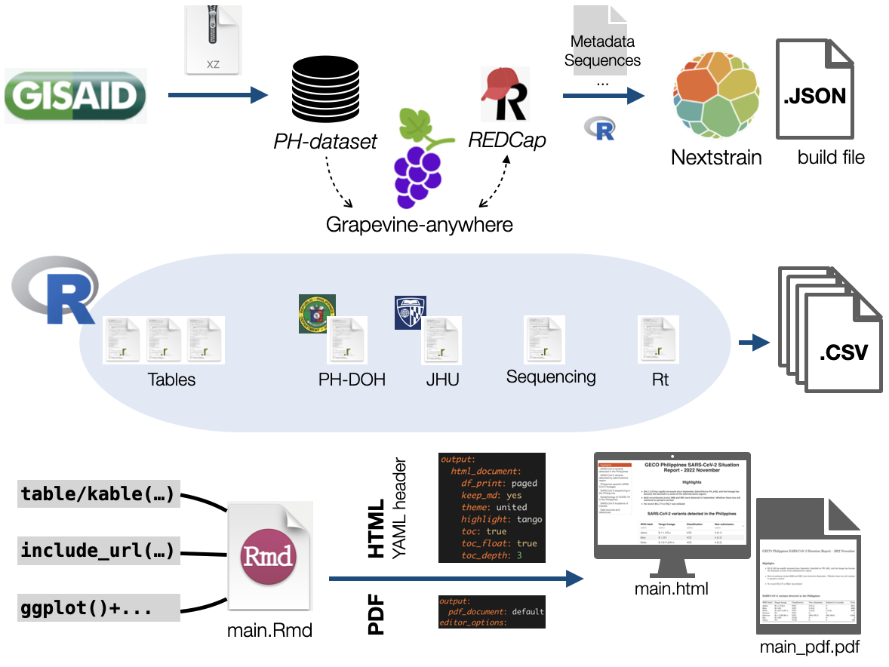

This workflow utilizes R scripts and the Nextstrain pipeline to analyze COVID-19 sequencing data isolated in the Philippines. The workflow consists of several steps including metadata processing and data cleaning. Below is an overview of the pipeline and its requirements



## Requirement

To run the pipeline, the following R packages are required:

```
tidyverse
yaml
seqinr
rjson
zoo
coronavirus
```

The workflow uses the output files from the [Grapevine-anywhere](https://github.com/GECO-PH/grapevine-anywhere). The RMD file also depends on a [Nnextstrain](https://docs.nextstrain.org/en) build visualized by Auspice. The build would presumably take the metadata generated by `metadata.R `. 


## Workflow

A bash script or a workflow management system such as Snakemake is recommended to concatenate different steps. However, a [check list](https://github.com/GECO-PH/GECO-covid/blob/main/report_workflow/check_list.md) is provided to track essential steps of process.


## RMD file

The following files are required to generate the report page:

- Table[1-3/Omicron].csv
- sequencing.csv
- R_region.csv
- postNS_metadata_PH
- _logo.jpg_


## Scripts

The folder consists of the following scripts:

#### 1. metadata.R 


- __Input:__ `metadata_gisaid_PH.tsv`, (1/)`redcap_metadata.strain.formatted.csv`, (1/)`redcap_formatted.fasta`, `redcap_metadata.csv`, (5/)`redcap_gisaid.lineages.with_all_traits.with_phylotype_traits.csv`

- __Output:__ `redcap_only.fasta`, `variant.txt`, `metadata_PH.tsv`
 

#### 2. DOH_data.R

- __Input:__ `information_batch_x.csv`

- __Output:__ `case_daily_region.csv`


#### 3. post_ns.R

This script performs a dry run to make sure there's no additional info to the metadata.

- __Input:__ `metadata_PH.tsv`

- __Output:__ `postNS_metadata_PH.csv`


#### 4. table1/table2/table3/table_Omicron

- __Input:__ `postNS_metadata_PH.csv`, `previous postNS_meta`

- __Usage:__ Rscript [_code_ e.g. table_1.R] [_period1_ e.g. 2022-12-01] [_period2_ e.g. 2023-02-28]


#### 5. jhu_data.R

- __Output:__ `case_JHU_PH.csv`


#### 6. Rt.R

- __Input:__ `case_daily_region.csv`

- __Output:__ `R_region.csv`


#### 7. sequencing.R

- __Input:__ `case_JHU_PH.R`, `postNS_metadata_PH.R`

- __Output:__ `sequencing.csv`


