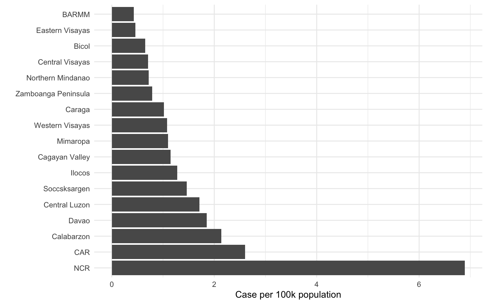
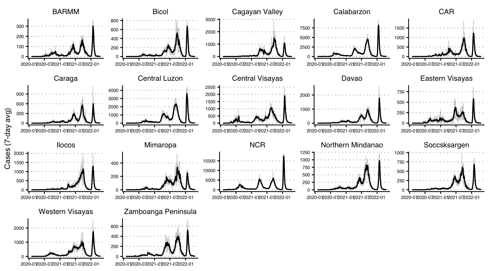

### Case per capita by administrative region

**Figure S1**. Case per capita by administrative region in the
Philippines. The data present the last time point showed in Figure 4.

   

### Case by administrative region

**Figure S2**. Number of cases by administrative region in the
Philippines. Gray lines present daily cases whereas black lines
represent average cases over seven days

#### [GECO Website](https://www.geco-seqlab.org/)

#### [GECO Monthly Report](https://geco-ph.github.io/GECO-covid/)
