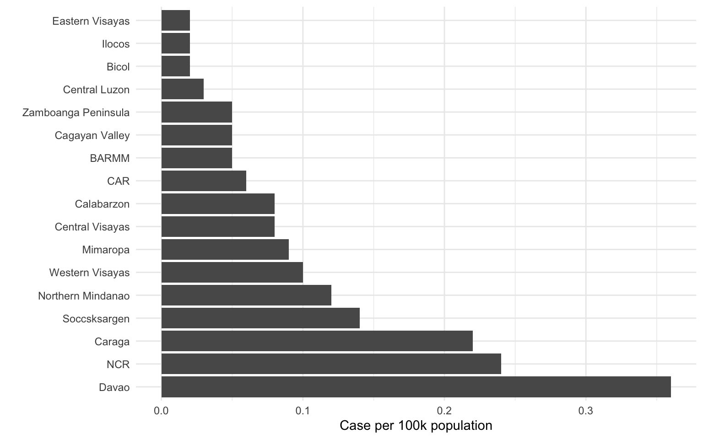
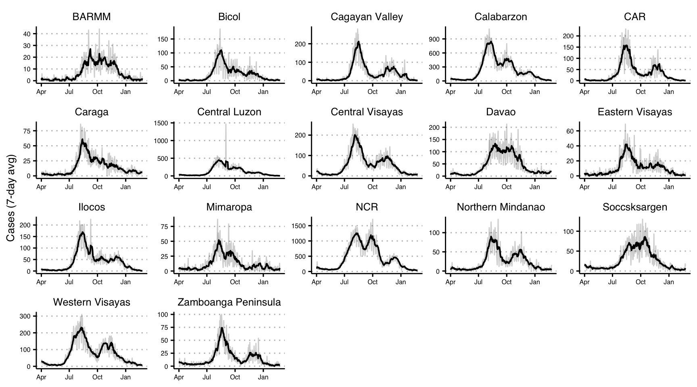

### Case per capita by administrative region

### Case by administrative region

#### [GECO Website](https://www.geco-seqlab.org/)

#### [GECO Monthly Report](https://geco-ph.github.io/GECO-covid/)
