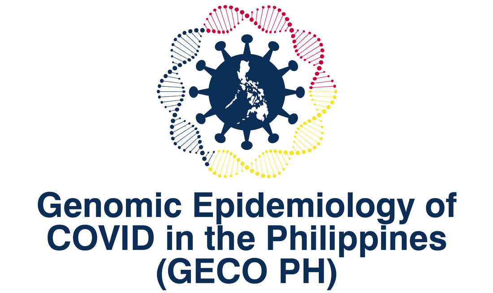

$~$

## Highlights

$~$

<h4> * Omicron variant accounts for most of the sequences isolated in December, 2021. </h4>

<h4> * Locally circulating Omicron viruses most likely belong to BA.2 lineage. </h4>  

$~$
$~$

## SARS-CoV-2 variants detected in the Philippines 

$~$

  

<strong>Table 1. Number of available sequences by variant in the Philippines as of 20 January 2022.</strong> The variants (VOC/VUM) here only include sequences that present in the GISAID or GECO data base and fulfill the definitions of WHO at the time the report is prepared. *New submission*, new sequences submitted from the last report. *Isolated in 4 months*, sequences isolated from 1 October 2021 to 20 January 2022. Numbers in the parentheses are percentage of the category (%).

$~$

<body>
<small> 

* __VOC (Variant of Concern):__ A SARS-CoV-2 variant that meets the definition of a VOI (see below) and, through a comparative assessment, has been demonstrated to be associated with (a) increase in transmissibility, (b) increase in clinical disease presentation or (c) decrease in effectiveness of public health measures including diagnostics, vaccines, therapeutics.

* __VOI (Variant of Interest):__ A SARS-CoV-2 variant: (a) with genetic changes that are predicted or known to affect virus characteristics such as transmissibility, disease severity, immune escape, diagnostic or therapeutic escape; AND (b) identified to cause significant community transmission or multiple COVID-19 clusters, in multiple countries with increasing relative prevalence alongside increasing number of cases over time. 

* __VUM (Variant Under monitoring):__ A SARS-CoV-2 variant with genetic changes that are suspected to affect virus characteristics with some indication that it may pose a future risk, but evidence of phenotypic or epidemiological impact is currently unclear, requiring enhanced monitoring and repeat assessment pending new evidence.

* __Pango lineage:__ A dynamic SARS-CoV-2 naming system that uses a phylogenetic framework (methods that involve a tree-like structure inferred based on genetic information of viruses) to identify actively spreading lineages. The Pango system is designed to track the transmission and spread of SARS-CoV-2, but does not attempt to identify or define VOCs or VOIs.  

</small>
</body>

$~$

<iframe src="https://nextstrain.org/community/GECO-PH/GECO-covid@main/20220123?c=variant&amp;d=frequencies&amp;f_country=Philippines&amp;p=full&amp;sidebar=closed&amp;onlyPanels" width="100%" height="250" data-external="1"></iframe>
<strong>Figure 1. Temporal frequencies of SARS-CoV-2 variants in the Philippines.</strong> The figure is constructed with a subsampled genomic data set from all available sequences ([methods](https://github.com/GECO-PH/GECO-covid/blob/main/supp/methods.md)). A more detailed illustration of SARS-CoV-2 lineages isolated in the country can be visualised by selecting PANGO Lineage as the option for coloring in the control panel (icon on top left/right). __Note__ that the latest available Philippine sequences were isolated on 28 December, 2021, thus the frequencies after the time point could harbor great uncertainty. 

$~$

__Diversity within the Omicron variant__

The two sublineages of the Omicron variant, denoted as BA.1 and BA.2, have been identified in the Philippines since December 2021. Based on the available data, all BA.2 sequences isolated in the Philippines (n=39) were likely originated from the same introduction. These sequences were also identified by the grapevine-anywhere pipeline as a single cluster (PH_137, see *PH specific lineages* section). Phylogenetic relationship of the sublineages of Omicron variant is available [here](https://nextstrain.org/community/GECO-PH/GECO-covid@main/20220123?c=pango_lineage&d=tree,map,frequencies&f_country=Philippines&label=clade:21K%20%28Omicron%29&p=full&sidebar=closed). Note that the BA.2 viruses do not have 69-70 deletions in the S protein, and therefore the SGTF (S-gene target failure) may not be used to detect the lineage (see *mutations of interest* section).

$~$

__Diversity within the Delta variants__

More than 70 Pango lineages have been found among Delta variants isolated in the Philippines, with >40 sublineages that have more than 2 isolated sequences as of January 2022. Among the sublineages of Delta variant, AY.28 is the most frequently isolated lineage in the Philippines, followed by AY.9.2. Phylogenetic relationship of the sublineages of Delta variant is available [here](https://nextstrain.org/community/GECO-PH/GECO-covid@main/20220123?c=pango_lineage&d=tree,map,frequencies&f_country=Philippines&label=clade:21A%20%28Delta%29&p=full&sidebar=closed).

$~$
$~$

## SARS-CoV-2 variants detected by administrative region

$~$

  

<strong>Table 2. Number of available sequences by administrative region in the Philippines as of 20 January 2022.</strong> The variant definition is identical to Table 1 based on the WHO website. *New submission*, new sequences submitted from the last report. *Dominant variant in 4 months*, the major variant isolated from 1 October 2021 to 20 January 2022. A dash indicates no sequence isolated. *Isolated in 4 months*, sequences isolated from 1 October 2021 to 20 January 2022. Numbers next to the dominant variant indicate percentage of the variant in the region, whereas other numbers in the parentheses are percentage of the category.

<body>

NCR, National Capital Region; CAR, Cordillera Administrative Region; BARMM, Bangsamoro Autonomous Region in Muslim Mindanao. 

</body>

$~$

<iframe src="https://nextstrain.org/community/GECO-PH/GECO-covid@main/20220123?c=variant&amp;d=map&amp;f_country=Philippines&amp;p=full&amp;sidebar=closed&amp;onlyPanels" width="100%" height="600" data-external="1"></iframe>
<strong>Figure 2. Frequencies of SARS-CoV-2 variants by administrative region in the Philippines.</strong> The figure is constructed with a subsampled genomic data set from all available sequences as Figure 1. Frequencies of isolates in a particular time frame can be adjusted with the control panel (icon on top left/right).  

$~$
$~$

## Philippines specific SARS-CoV-2 lineages 

$~$

<iframe src="https://nextstrain.org/community/GECO-PH/GECO-covid@main/20220123?c=cluster&amp;d=frequencies&amp;f_source=GECO&amp;onlyPanels&amp;p=full&amp;sidebar=closed" width="100%" height="250" data-external="1"></iframe>
<strong>Figure 3. Temporal frequencies of Philippine lineages (clusters) identified by [Grapevine-anywhere](https://github.com/GECO-PH/grapevine-anywhere).</strong> Each sequence submitted to GECO database would undergo *Grapevine-anywhere* pipeline to detect sustain local transmission. A cluster is defined based on multiple sequences isolated in the Philippines that appeared to descend from the same introductory event on a phylogenetic tree. Phylogenetic relationships of these lineages can be found [here](https://nextstrain.org/community/GECO-PH/GECO-covid@main/20220123?c=cluster&d=tree&f_country=Philippines&onlyPanels&p=full&sidebar=closed).

$~$

  

<strong>Table 3. Number of sequences by cluster identified with the Grapevine-anywhere as of 20 January 2022.</strong> A cluster is defined based on multiple sequences isolated in the Philippines that appeared to descend from the same introductory event on a phylogenetic tree. *Date first identified*, the isolation date of the first identified sequence. *Pango lineage*, the major Pango lineage of the sequences that belong to the same cluster. *New submission*, new sequences submitted from the last report. *Isolated in 4 months*, sequences isolated from 1 October 2021 to 20 January 2022.

$~$
$~$

## SARS-CoV-2 sequencing in the Philippines

$~$

### Total available SARS-CoV-2 sequences in the Philippines: **13191**
### SARS-CoV-2 sequences from GECO project: **698**

$~$

<strong>Figure 4. Number of COVID-19 cases and the proportion of sequenced samples in the Philippines.</strong> The gray line indicates the mean cases in a 7 days window based on the JHU data base, whereas the red bars indicate the estimated percentage of sequenced samples among cases in a month. The proportions in January and February, 2020 were discarded as they are outliers.

$~$
$~$

## Epidemiology of COVID-19 in the Philippines

$~$

<strong>Figure 5. Mean effective reproductive number (Rt) of COVID-19 in the Philippines by region from December 2021 to January, 2022.</strong> The reproductive number (R) is defined as the number of new infections that one infected patient can cause in a susceptible population. Here, *the mean effective reproductive number* (Rt) was inferred by daily number of cases reported in MOH, Philippines in a window of seven days. The horizontal line indicates one. If Rt is greater than 1, the case number in the region will likely continue to grow. If the Rt is below 1, the new cases may continue to appear at a slower rate. The R values denoted with the region name represent the most recent estimates. More regional epidemiological statistics can be found [here](https://github.com/GECO-PH/GECO-covid/blob/main/supp/region.md).

$~$
$~$

## SARS-CoV-2 mutations of interest

Spike protein

* __69-70Del__ (Alpha, Omicron): [Distribution on the Philippine isolates](https://nextstrain.org/community/GECO-PH/GECO-covid@main/20220123?c=variant&d=tree&f_country=Philippines&gt=S.69-,70-&onlyPanels&p=full&sidebar=closed)

* __T95I__ (Mu, Omicron): [Distribution on the Philippine isolates](https://nextstrain.org/community/GECO-PH/GECO-covid@main/20220123?c=gt-S_95&d=tree&f_country=Philippines&onlyPanels&p=full&sidebar=closed)

* __144-__ (Alpha, Eta, Omicron): [Distribution on the Philippine isolates](https://nextstrain.org/community/GECO-PH/GECO-covid@main/20220123?c=gt-S_144&d=tree&f_country=Philippines&onlyPanels&p=full&sidebar=closed)

* __K417N__ (Beta, Omicron): [Distribution on the Philippine isolates](https://nextstrain.org/community/GECO-PH/GECO-covid@main/20220123?c=gt-S_417&d=tree&f_country=Philippines&onlyPanels&p=full&sidebar=closed)

* __T478K__ (Delta, Omicron): [Distribution on the Philippine isolates](https://nextstrain.org/community/GECO-PH/GECO-covid@main/20220123?c=gt-S_478&d=tree&f_country=Philippines&onlyPanels&p=full&sidebar=closed)

* __E484K__ (Beta, Gamma, Eta, Mu): [Distribution on the Philippine isolates](https://nextstrain.org/community/GECO-PH/GECO-covid@main/20220123?c=gt-S_484&d=tree&f_country=Philippines&onlyPanels&p=full&sidebar=closed)

* __N501Y__ (Alpha, Beta, Gamma, Mu, Omicron): [Distribution on the Philippine isolates](https://nextstrain.org/community/GECO-PH/GECO-covid@main/20220123?c=gt-S_501&d=tree&f_country=Philippines&onlyPanels&p=full&sidebar=closed)

* __H655Y__ (Gamma, Omicron): [Distribution on the Philippine isolates](https://nextstrain.org/community/GECO-PH/GECO-covid@main/20220123?c=gt-S_655&d=tree&f_country=Philippines&onlyPanels&p=full&sidebar=closed)

$~$

<body>
<small> 

Relevant functions including antibody escape (S 69-70Δ, S 144, S 417, S 484) and receptor binding (S 417, S 484, S 501). 69-70Del or 69-70Δ, deletions at positions 69-70. 

</small>
</body>

$~$
$~$

## Data sources and references

Data

* [GECO website](https://www.geco-seqlab.org)
* [DOH Data drop](https://drive.google.com/drive/folders/1ZPPcVU4M7T-dtRyUceb0pMAd8ickYf8o)
* [GISAID](http://gisaid.org) ([acknowledgement table](https://github.com/GECO-PH/GECO-covid/tree/main/acknowledgement_table))
* [JHU COVID data](https://coronavirus.jhu.edu)

Methods

* [Analyses in this report](https://github.com/GECO-PH/GECO-covid/blob/main/supp/methods.md)
* [Nextstrain](https://nextstrain.org) ([build](https://nextstrain.org/community/GECO-PH/GECO-covid@main/20220123) for GECO project)
* [Grapevine-anywhere](https://github.com/GECO-PH/grapevine-anywhere)

References

* [WHO](https://www.who.int/en/activities/tracking-SARS-CoV-2-variants/)
* [Pango lineage list](https://cov-lineages.org/lineage_list.html)

### PDF version and previous reports

2021-11 [pdf](https://github.com/GECO-PH/GECO-covid/blob/main/report/2021-November.pdf)

2021-12 [pdf](https://github.com/GECO-PH/GECO-covid/blob/main/report/2021-December.pdf)

2022-01 [pdf](https://github.com/GECO-PH/GECO-covid/blob/main/report/2022-January.pdf)

$~$

